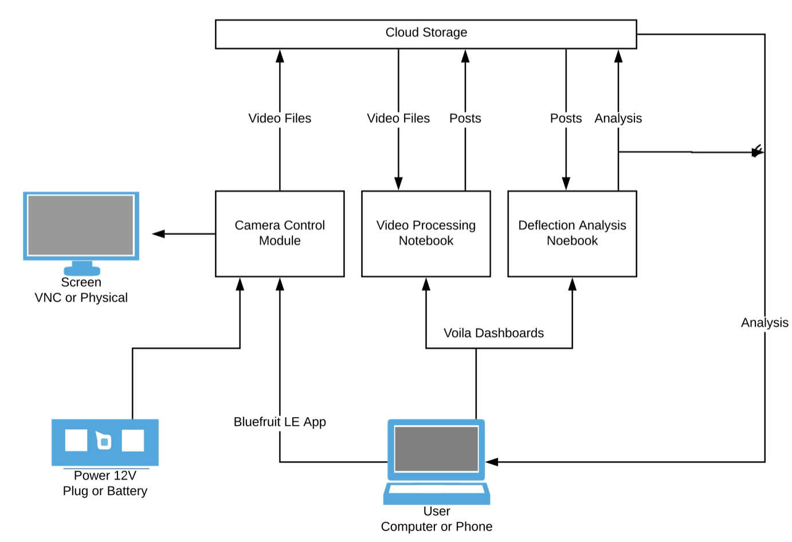

# Tissue Tracking Source Code Repo

## Visit https://github.com/Jack-alope/Multi_Tissue_Tracking
   

This is a system designed to track and analyze post deflections caused by cardiac tissue contractions. It is written entirely in python based [Jupyter Notebooks](https:/jupyter.org/), hosted using [The Littlest JupyterHub](http://tljh.jupyter.org/), and rendered using [Voila](https://github.com/voila-dashboards/voila/). 

This README.md will act as a user manual, explaining each part of this project and how it is meant to be used. 

>This is a diagram of the basic workflow while using this system.
>

## Post Tracking Dashboard
_Using Matplotlib widgets to allow users to select posts for tracking and leveraging OpenCV libraries to track the posts through the frames_

## Analysis Dashboard
_Using ipywidgets and plotly allows for interactive graphing and selection of the data_  
  
Analysis Parameters:
><strong>_Polynomial:_</strong> What degree polymonial should be used in the curve finding.  
<strong>_Window Length:_</strong> Number of coefficients used for the smoothing. Must be odd, must be larger than polynomial.  
<strong>_Peak Sensitiy:_</strong> How sensitive it is to finding peaks. Between (0, 1).  
<strong>_Buffer:_</strong> If there basepoint is too high adjust this.   
<strong>_Minimum Distance:_</strong> If there is a double peak use this to ignore one
